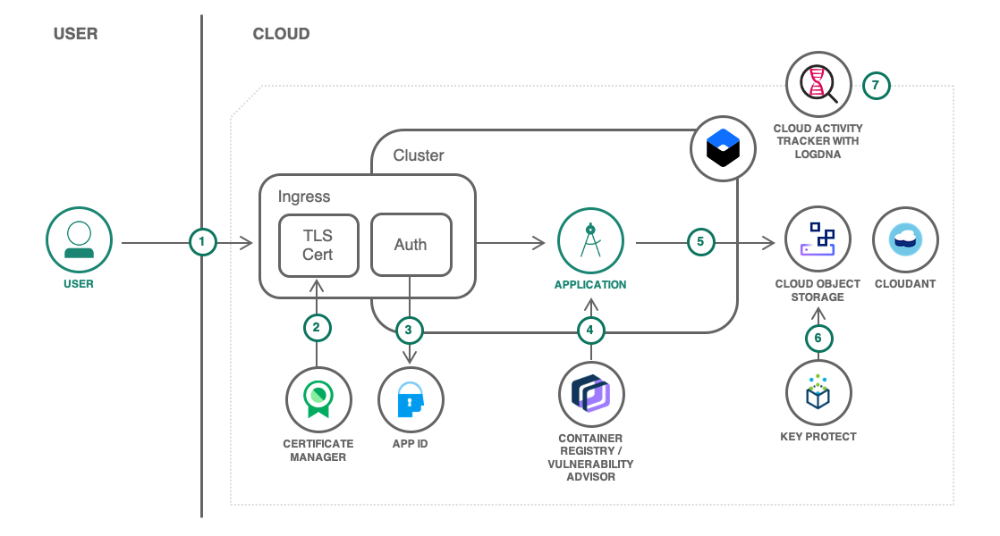

# Apply end to end security to a cloud application

The repository features a sample application that enables groups of users to upload files to a common storage pool and to provide access to those files via shareable links. The application is written in Node.js and deployed as Docker container to the IBM Cloud Kubernetes service. It leverages several security-related services and features to improve app security. It includes data encrypted with your own keys, user authentication, and security auditing.

Refer to [this tutorial](https://cloud.ibm.com/docs/tutorials?topic=solution-tutorials-cloud-e2e-security) for instructions.



1. The user connects to the application.
2. [App ID](https://cloud.ibm.com/catalog/services/AppID) secures the application and redirects the user to the authentication page. Users can sign up from there too.
3. The application is running in a [Kubernetes cluster](https://cloud.ibm.com/containers-kubernetes/catalog/cluster) from an image stored in the [container registry](https://cloud.ibm.com/containers-kubernetes/launchRegistryView). The image is automatically scanned for vulnerabilities.
4. Files uploaded by the user are stored in [Cloud Object Storage](https://cloud.ibm.com/catalog/services/cloud-object-storage).
5. The bucket where the files are stored is using a user-provided key to encrypt the data.
6. All activities related to managing the solution are logged by [Cloud Activity Tracker with LogDNA](https://cloud.ibm.com/catalog/services/logdnaat).

## Deploy with a toolchain

This project comes with a partially automated toolchain capable of deploying the application to IBM Cloud while provisioning all required services.

### Prerequisites

1. Create a **standard** Kubernetes cluster

1. Create a registry namespace

1. Optionally create a specific resource group for this project

### And then

[](https://cloud.ibm.com/devops/setup/deploy/?repository=https%3A//github.com/IBM-Cloud/secure-file-storage)

Once the toolchain has completed, the application will be available at `https://secure-file-storage.<your-cluster-ingress-domain>`.

The toolchain includes a stage named **UNINSTALL (manual)**. This stage can only be triggered manually and will remove all resources created by the toolchain (app and services).

If the deploy stage fails with the error, *The account already has an instance created with the Lite plan*, configure the stage's environment variables `COS_PLAN=standard` or `APP_ID_PLAN=graduated-tier` or `CLOUDANT_PLAN=standard` based on the failed service. You can then re-run the deploy stage (you do not need to re-create the toolchain).

## Code Structure

| File | Description |
| ---- | ----------- |
|[app.js](app.js)|Implementation of the application.|
|[credentials.template.env](credentials.template.env)|To be copied to `credentials.env` and filled with credentials to access services. `credentials.env` is used when running the app locally and to create a Kubernetes secret before deploying the application to a cluster manually.|
|[Dockerfile](Dockerfile)|Docker image description file.|
|[secure-file-storage.template.yaml](secure-file-storage.template.yaml)|Kubernetes deployment file with placeholders. To be copied to `secure-file-storage.yaml` and edited to match your environment.|

### To test locally

1. Follow the tutorial instructions to have the app deployed to a cluster. Specially the sections to create all the services and to populate the `credentials.env` file. You will need the public instead of the private COS endpoint in order to access Cloud Object Storage from your machine.
1. Access the tokens with `https://secure-file-storage.<INGRESS_SUBDOMAIN>/api/tokens`. This will shows the raw App ID authorization header together with the decode JWT tokens for your session.
1. In your local shell:
   ```
   export TEST_AUTHORIZATION_HEADER="<value of the header attribute 'Bearer ... ...'>"
   ```
1. npm start

## License

See [License.txt](License.txt) for license information.
