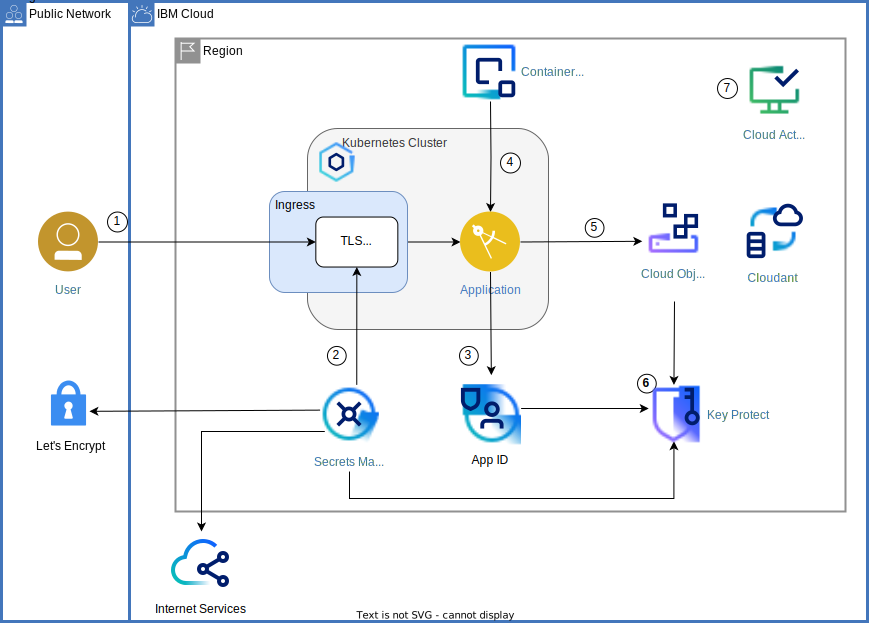

> Older code versions for this tutorial can be found in the branches [archive_classic_tekton](https://github.com/IBM-Cloud/secure-file-storage/tree/archive_classic_tekton) and [classic_pipeline_RETIRED](https://github.com/IBM-Cloud/secure-file-storage/tree/classic_pipeline_RETIRED).

This repository is used by two IBM Cloud solution tutorials:
- [Apply end to end security to a cloud application](https://cloud.ibm.com/docs/solution-tutorials?topic=solution-tutorials-cloud-e2e-security)
- [Enhance cloud security by applying context-based restrictions](https://cloud.ibm.com/docs/solution-tutorials?topic=solution-tutorials-cbr-enhanced-security)

# Apply end to end security to a cloud application

The repository features a sample application that enables groups of users to upload files to a common storage pool and to provide access to those files via shareable links. The application is written in Node.js and deployed as Docker container to the IBM Cloud Kubernetes service. It leverages several security-related services and features to improve app security. It includes data encrypted with your own keys, user authentication, and security auditing.

Refer to [this tutorial](https://cloud.ibm.com/docs/solution-tutorials?topic=solution-tutorials-cloud-e2e-security) for instructions.

1. The user connects to the application.
2. Optionally [Secrets Manager](https://cloud.ibm.com/catalog/services/secrets-manager) is used to store/retrieve SSL/TLS certificates.
3. [App ID](https://cloud.ibm.com/catalog/services/AppID) secures the application and redirects the user to the authentication page. Users can sign up from there too.
4. The application is running in a Kubernetes cluster (either [IBM Cloud Kubernetes Service](https://cloud.ibm.com/docs/containers?topic=containers-getting-started#getting-started) or [Red Hat OpenShift on IBM Cloud](https://cloud.ibm.com/docs/openshift?topic=openshift-getting-started)) from an image stored in the [container registry](https://cloud.ibm.com/containers-kubernetes/launchRegistryView). The image is automatically scanned for vulnerabilities.
5. Files uploaded by the user are stored in [Cloud Object Storage](https://cloud.ibm.com/catalog/services/cloud-object-storage).
6. The bucket where the files are stored is using a user-provided key to encrypt the data.
7. All activities related to managing the solution are logged by [Cloud Activity Tracker with LogDNA](https://cloud.ibm.com/catalog/services/logdnaat).

The application can be deployed using a toolchain.

# Enhance cloud security by applying context-based restrictions
To further enhance security, context-based restrictions are implemented on top the deployed resources as shown.

Refer to the tutorial [Enhance cloud security by applying context-based restrictions](https://cloud.ibm.com/docs/solution-tutorials?topic=solution-tutorials-cbr-enhanced-security) for details and instructions.

## Deploy with a toolchain and Terraform

This project comes with a partially automated toolchain capable of deploying the application to IBM Cloud. The entire environment, including the needed services and the toolchain, is set up using Terraform (Infrastructure as Code). The Terraform scripts are managed in a [Schematics workspace](https://cloud.ibm.com/schematics/workspaces).

### Prerequisites

1. [Create an IBM Cloud Kubernetes Service](https://cloud.ibm.com/kubernetes/catalog/create) or [Red Hat OpenShift on IBM Cloud](https://cloud.ibm.com/kubernetes/catalog/create?platformType=openshift) cluster in a VPC (Virtual Private Cloud). Make sure to attach a Public Gateway for each of the subnets your worker nodes are deployed into as it is required for App ID.
2. Have an instance of [Continuous Delivery](https://cloud.ibm.com/catalog/services/continuous-delivery) service to be used by the toolchain.
3. Have an existing [namespace in the IBM Cloud Container Registry](https://cloud.ibm.com/registry/namespaces).
4. Optionally create a specific [resource group](https://cloud.ibm.com/account/resource-groups) for this project.

Please note that the Kubernetes cluster and the resources deployed via Terraform / Schematics have to be in the same region and resource group. The app is deployed to the Kubernetes cluster and hence in the same region and resource group, too.

### Deploy resources using Terraform managed by Schematics

Either create the Schematics workspace automatically by clicking this ["deploy link"](https://cloud.ibm.com/schematics/workspaces/create?repository=https://github.com/IBM-Cloud/secure-file-storage/tree/master/terraform&terraform_version=terraform_v1.5). Or set it up manually by going to the [Schematics workspaces](https://cloud.ibm.com/schematics/workspaces) and using https://github.com/IBM-Cloud/secure-file-storage/tree/master/terraform as source respository including the path and the latest version of Terraform runtime.

Configure all required variables:
- **basename**: project basename which is used as prefix for names, e.g., secure-file-storage
- **region** is where the resources will be deployed and the location of the existing Kubernetes cluster: us-south, eu-de, ...
- **iks_cluster_name**: name of your existing VPC-based Kubernetes cluster
- **iks_namespace**: Kubernetes namespace into which to deploy the app. It will be created if it does not exist.
- **resource_group** is the name of the IBM Cloud resource group where to deploy the services into.
- **toolchain_registry_namespace**: The existing namespace in the Container Registry to use.
- **toolchain_registry_region**: The Container Registry region
- **toolchain_apikey**: An IBM Cloud API key to use for building the container image with the app, pushing it to the Container Registry, and deploying it to the Kubernetes cluster.
- **toolchain_failscan**: Set to false to not fail in case vulnerabilities are detected.
- **deploy_cbr**: Indicates whether the CBR zones and rules should be deployed. `false` by default and can be set to `true`.
- **cbr_enforcement_mode**: By default, the CBR rules are in `report` mode only. Change and set to `enforced` or `disabled`.
- **cbr_homezone_iprange**: Can be set to the IP range of your home or bastion network. 

Be sure to click "**Save**".

Next, optionally click "**Generate plan**" to verify everything would be working ok. Or directly click on **Apply plan** to deploy the configured resources, authorizations and service keys as well as the toolchain:
- App ID
- Cloud Object Storage
- Cloudant NoSQL database
- Key Protect

**Note:** By default, services are provisioned with service plans that should work in typical accounts. It means that paid plans are used. If you want to change to lite plans, you may configure different plans by changing values for variables like **cos_plan**, **appid_plan**, etc.

### Run the deployment pipeline
Go to the [toolchains](https://cloud.ibm.com/devops/toolchains) page. Make sure to be in the correct region. Click on the toolchain **secure-file-storage-toolchain**, then on the delivery pipeline **secure-file-storage-pipeline**. Finally, **Run Pipeline** and choose the manual trigger **manual-trigger-builddeploy** to build and deploy the app. You can click on the details of the pipeline run to see and examine the diagnostic logs.

### Uninstall
The toolchain includes a trigger to uninstall the app. Click **Run Pipeline**, select the trigger **manual-trigger-uninstall** and run the pipeline. When it has finished, switch to the [Schematics workspace](https://cloud.ibm.com/schematics/workspaces) and select the action to **Destroy resources**. Thereafter, select **Delete workspace** which removes the workspace itself. Only deleting the workspace keeps the resources.

## Code Structure
The file for the Infrastructure as Code, the Continuous Delivery pipeline, and the app itself are organized in several directories.

### Terraform
The [terraform](terraform) directory holds the resource configurations files. They are loaded into the Schematics workspace to provision or destroy the resources including the toolchain.

### Pipeline

The directory [.tekton](.tekton) has the files to define the pipelines, their tasks and how the pipelines are triggered.

The file [.tekton/pipelines.yaml](.tekton/pipelines.yaml) defines two pipelines, one for the build & deploy process, one to uninstall the app. The "build & deploy" pipeline has four tasks:
1. **git-repo-changes** clones the source repository and checks for code changes to the toolchain and app.
2. **build** uses the task [icr-containerize](https://github.com/open-toolchain/tekton-catalog/blob/master/container-registry/README.md#icr-containerize) from the Open Toolchain Tekton Catalog to build the Docker image.
3. **va-scan** runs and checks vulnerability checks on the newly built image. It facilitates the IBM Cloud Container Registry for that purpose.
4. **deploy-to-kubernetes** deploys the Docker image to the Kubernetes cluster and configures the app.

Note that the pipeline definition includes an inactive check to only build and deploy the app if there were app-related changes. Uncomment that section in the source code to enable the check.

### App
Located in the [app](app) directory:

| File | Description |
| ---- | ----------- |
|[app.js](app/app.js)|Implementation of the application.|
|[app/credentials.template.env](app/credentials.template.env)|To be copied to `credentials.env` and filled with credentials to access services. `credentials.env` is used when running the app locally and to create a Kubernetes secret before deploying the application to a cluster manually.|
|[app/Dockerfile](app/Dockerfile)|Docker image description file.|
|[app/secure-file-storage.template.yaml](app/secure-file-storage.template.yaml)|Kubernetes deployment file with placeholders. To be copied to `secure-file-storage.yaml` and edited to match your environment.|
|[app/secure-file-storage-ingress.template.yaml](app/secure-file-storage-ingress.template.yaml)|Kubernetes network configuration file with placeholders. To be copied to `secure-file-storage-ingress.yaml` and edited to match your environment.|

### To test locally
The app can be tested and developed locally, either directly by using `npm start` or by building and running a container by leveraging the `Dockerfile`. 

1. Follow the tutorial instructions to create all the services and to populate the `credentials.env` file. You will need the public instead of the private COS endpoint in order to access Cloud Object Storage from your machine.
2. Add `http://0.0.0.0/redirect_uri` to App ID as Web redirect URI. See the [section in tutorial](https://cloud.ibm.com/docs/solution-tutorials?topic=solution-tutorials-cloud-e2e-security#cloud-e2e-security-11) for details.
3. `npm start` or `node app.js` to start the app. To use a container, utilize `docker build` and `docker run` commands.
4. Access the local app through the shown URL. Now, you can change the app source code and test locally.

## License

See [License.txt](License.txt) for license information.
